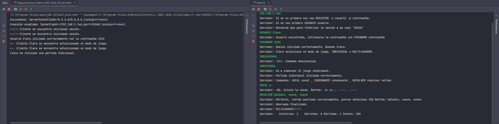

# Ahorcado 

Este proyecto es un servidor para el juego del Ahorcado que soporta tanto partidas individuales como multijugador. Utiliza sockets para permitir la comunicación entre los clientes y el servidor, y gestiona la lógica del juego, incluyendo la elección de refranes, el control de turnos, y el sistema de puntuaciones.

---

## Estructura del Proyecto

### 1. `Multijugador` 

Esta clase hereda de `Thread` y se encarga de manejar a los jugadores en partidas multijugador. Cada jugador tiene su propio hilo, lo que permite que varios jugadores interactúen de forma simultánea. Se gestionan los turnos y la puntuación de cada uno.

- **Atributos principales:**
    - `nombre`: Nombre del jugador.
    - `pts`: Puntos acumulados por el jugador.
    - `jugadores[]`: Arreglo que almacena hasta tres jugadores por partida.

- **Métodos importantes:**
    - `comprobarTurno(String msg)`: Verifica si es el turno del jugador que envió el mensaje y ejecuta el comando apropiado (adivinar vocal, consonante o resolver el refrán).
    - `run()`: Controla el ciclo de vida del hilo, gestionando las interacciones entre los jugadores.

- **Fragmento de código relevante:**
  ```java
  public static String comprobarTurno(String msg) {
      String texto = "-Err. Comando incorrecto";
      String[] mensajes = msg.split(" ");
      if(mensajes[0].equalsIgnoreCase("ADIOS")){
          partida = 1;
      } else {
          if(jugadores[cont] == jugador){
              texto = Juego.comprobarRefran(msg, false, jugadores[cont].getNombre());
              if(cont == 2){
                  cont = 0;
              } else {
                  cont++;
              }
          } else {
              texto = "-Err. Espere su turno. Turno de: " + jugador.getNombre();
          }
      }
      return texto;
  }
  ```

### 2. `Juego`

Esta clase maneja la lógica del juego de ahorcado, incluyendo la elección del refrán, la verificación de letras, y la puntuación según el número de intentos.

- **Atributos principales:**
    - `refranBase`: El refrán que se ha elegido para la partida.
    - `refranActualizado`: La versión del refrán con las letras adivinadas hasta el momento.
    - `intentos`: Cuenta los intentos del jugador en adivinar el refrán.

- **Métodos importantes:**
    - `elegirRefran()`: Selecciona aleatoriamente un refrán para el juego.
    - `comprobarRefran(String msg, boolean individual, String user)`: Verifica si el jugador ha acertado una letra o si ha resuelto el refrán correctamente.

- **Fragmento de código relevante:**
  ```java
  public static void recorrerRefran(char l) {
        String refran = "";
        cont = 0;
        if(refranActualizado != null) {
            for (int i = 0; i < refranBase.length(); i++) {
                if (refranBase.charAt(i) == l && refranActualizado.charAt(i) == '-') {
                    refran += l;
                    cont++;
                } else if (refranBase.charAt(i) == ',') {
                    refran += ',';
                } else if (refranBase.charAt(i) == ' ') {
                    refran += ' ';
                } else if (refranActualizado.charAt(i) != '-') {
                    refran += refranActualizado.charAt(i);
                } else {
                    refran += '-';
                }
            }
            refranActualizado = refran;
        } else {
            refranActualizado = "";
            for (int i = 0; i < refranBase.length(); i++) {
                if (refranBase.charAt(i) == ',') {
                    refranActualizado += ',';
                } else if (refranBase.charAt(i) == ' ') {
                    refranActualizado += ' ';
                } else {
                    refranActualizado += '-';
                }
            }
        }

    }
    public static String comprobarRefran(String msg, boolean individual, String user) {
        String[] mensajes = msg.split("\\s+");
        String texto = "-Err. Comando desconocido.";
        switch(mensajes[0]) {
            case "VOCAL":
                intentos++;
                if(vocales.contains(mensajes[1].charAt(0))) {
                    recorrerRefran(mensajes[1].charAt(0));
                    if(cont > 0) {
                        if(individual) {
                            texto = "+Ok. Existe la vocal. Refrán: " + refranActualizado;
                        } else {
                            if(Multijugador.getPts(user) >= 50){
                                texto = "+Ok. Existe la vocal. -50pts. Refrán: " + refranActualizado;
                                Multijugador.setPts(user,(Multijugador.getPts(user) - 50));
                            } else {
                                texto = "-Err. Saldo insuficiente.";
                            }

                        }
                        texto = "+Ok. Existe la vocal. Refrán: " + refranActualizado;
                    } else {
                        texto = "-Ok. Vocal Incorrecta. Refrán: " + refranActualizado;
                    }
                } else if (consonantes.contains(mensajes[1].charAt(0))) {
                    texto = "-Err. Debe introducir una vocal no una consonante.";
                }
                break;
            case "CONSONANTE":
                intentos++;
                if(consonantes.contains(mensajes[1].charAt(0))) {
                    recorrerRefran(mensajes[1].charAt(0));
                    if(cont > 0) {
                        if(individual) {
                            texto = "+Ok. Existe la consonante. Refrán: " + refranActualizado;
                        } else {
                            texto = "+Ok. Existe la consonante. +" + 50*cont + "pts. Refrán: " + refranActualizado;
                            Multijugador.setPts(user,(Multijugador.getPts(user) + (50*cont)));
                        }
                    } else {
                        texto = "-Ok. Consonante Incorrecta. Refrán: " + refranActualizado;
                    }
                } else if (vocales.contains(mensajes[1].charAt(0))) {
                    texto = "-Err. Debe introducir una consonante no una vocal.";
                }
                break;
            case "RESOLVER":
                String[] resolver = refranBase.split("\\s+");
                int contadorAciertos = 0;
                for(int i = 0; i < resolver.length; i++) {
                    if(mensajes[i+1].equals(resolver[i])) {
                        contadorAciertos++;
                    }
                }
                if(contadorAciertos == resolver.length) {
                    HiloAhorcado.setPuntos(getPuntos() + HiloAhorcado.getPuntos());
                    texto = "Perfecto, refrán acertado correctamente, puntos obtenidos " + getPuntos() + " Refrán: " + refranBase;
                    HiloAhorcado.setAcertado(0);
                } else {
                    texto = "-Err. Mal :(, refrán incorrecto, el refrán era: " + refranBase;
                    HiloAhorcado.setAcertado(1);
                }
                break;
        }
        return texto;
    }
  ```

### 3. `Usuarios`

Esta clase gestiona los datos de los usuarios. Los datos se almacenan en un archivo de texto que guarda el nombre de usuario, la contraseña, las partidas jugadas, victorias, derrotas y puntos totales. Provee métodos para verificar usuarios, agregar nuevos, y actualizar su información.

- **Atributos principales:**
    - `file`: Archivo de texto que almacena los datos de los usuarios.

- **Métodos importantes:**
    - `infoUsuario(String nom)`: Retorna la información del usuario (partidas jugadas, victorias, derrotas, puntos).
    - `usuarioNuevo(String nom, String con)`: Agrega un nuevo usuario al archivo.
    - `guardadoAutomatico(String nom, int[] info)`: Actualiza automáticamente los datos de un usuario después de cada partida.

- **Fragmento de código relevante:**
  ```java
  public synchronized static void usuarioNuevo(String nom, String con) throws IOException {
      BufferedWriter bw = new BufferedWriter(new FileWriter(file, true));
      try {
          bw.newLine();
          bw.write( nom + " " + con + " " + 0 + " " + 0 + " " + 0 + " " + 0);//nombre, contraseña, partidas, victorias, derrotas, puntos
          bw.flush();
      } catch (Exception e) {
          System.out.println("ERROR: " + e.getMessage());
      }
  }
  ```

## Cómo ejecutar el proyecto

1. **Compilar el proyecto:**  
   Usa un IDE como IntelliJ o Eclipse para compilar y ejecutar el proyecto.

2. **Ejecutar el servidor:**  
   Lanza el servidor para comenzar a aceptar conexiones de clientes que quieran jugar al Ahorcado.

3. **Conectarse al servidor con Cliente:**  
   Los clientes pueden conectarse al servidor e iniciar partidas individuales o multijugador, siendo multijugador una partida de 3 personas.

## Funcionalidades

- **Modo Individual:**  
  El jugador puede adivinar letras o resolver el refrán por su cuenta.

- **Modo Multijugador:**  
  Hasta tres jugadores pueden participar en una partida multijugador, donde se alternan los turnos para adivinar las letras del refrán.

- **Puntuación:**  
  Los jugadores acumulan puntos en función de las letras acertadas y la velocidad en resolver el refrán.

## Notas adicionales

- **Archivos:**  
  El archivo `Usuarios.txt` almacena todos los usuarios registrados junto con su información de partidas.

---
### Mi nombre es Mario Alguacil Juárez y esta es la explicación de mi código y pasos a seguir para ejecutarlo. Espero que le haya gustado, un placer :)

